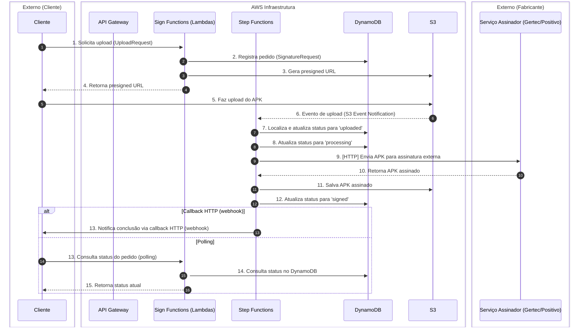

# Diagrama de Sequência do Processo de Assinatura de APKs

---

## Notas sobre a Arquitetura

- O API Gateway está presente na infraestrutura AWS, atuando como proxy transparente para todas as chamadas do Cliente às Sign Functions (Lambdas).
- O upload do APK no S3 gera um evento automático (S3 Event Notification) que aciona diretamente o Step Functions (sem SQS ou EventBridge intermediários).
- O Step Functions acessa o DynamoDB para localizar o registro do upload e segue o fluxo de assinatura.
- O termo "Sign Functions (Lambdas)" indica que o fluxo pode envolver múltiplas funções Lambda especializadas, e não um único Lambda monolítico.
- O processamento assíncrono é orquestrado por Step Functions, que permite integração direta via HTTP com o serviço assinador externo, reduzindo custos e tempo de execução de Lambdas.
- A notificação ativa ao cliente externo deve ser feita via callback HTTP (webhook), caso o cliente forneça uma URL de retorno. Alternativamente, o cliente pode realizar polling consultando o status do pedido via API.
- A autenticação e autorização das requisições é responsabilidade de outra entidade/sistema (ex: API Gateway integrado a um serviço de identidade/autorização corporativo), não sendo escopo deste projeto.

---

## Descrição dos Steps

1. **Solicita upload (UploadRequest):** O cliente inicia o processo enviando uma requisição de upload para as Sign Functions (requisição passa pelo API Gateway).
2. **Registra pedido (SignatureRequest):** Uma Sign Function registra o pedido no DynamoDB para rastreabilidade.
3. **Gera presigned URL:** Uma Sign Function gera uma URL temporária para upload seguro no S3.
4. **Retorna presigned URL:** A Sign Function retorna a URL para o cliente.
5. **Faz upload do APK:** O cliente faz upload do arquivo diretamente para o S3.
6. **Evento de upload (S3 Event Notification):** O S3 emite um evento ao receber o arquivo, que aciona diretamente o Step Functions.
7. **Localiza e atualiza status para 'uploaded':** O Step Functions acessa o DynamoDB, localiza o registro do upload e atualiza o status para 'uploaded'.
8. **Atualiza status para 'processing':** O Step Functions atualiza o status do pedido no DynamoDB.
9. **[HTTP] Envia APK para assinatura externa:** O Step Functions faz uma chamada HTTP direta ao serviço assinador externo (sem Lambda intermediário).
10. **Retorna APK assinado:** O serviço assinador retorna o APK assinado para o Step Functions.
11. **Salva APK assinado:** O Step Functions armazena o APK assinado no S3.
12. **Atualiza status para 'signed':** O Step Functions atualiza o status final do pedido no DynamoDB.
13. **Notifica conclusão via callback HTTP (webhook):** O Step Functions faz uma chamada HTTP POST para a URL de callback fornecida pelo cliente, informando a conclusão do processo e/ou o link do APK assinado.
14. **Consulta status do pedido (polling):** Alternativamente, o cliente pode consultar periodicamente o status do pedido via API, que retorna o status atual do DynamoDB.

---

*Este diagrama representa o fluxo completo do processo de assinatura de APKs, separando claramente as responsabilidades entre a infraestrutura AWS e os serviços externos dos fabricantes. As Sign Functions (Lambdas) são responsáveis pela orquestração inicial e persistência dos pedidos. O Step Functions, acionado diretamente pelo S3, orquestra o processamento assíncrono, incluindo integração HTTP direta com o assinador externo e notificação ativa ao cliente via webhook ou polling, otimizando custos e escalabilidade. A autenticação/autorização é responsabilidade de outro sistema e não faz parte deste escopo.*
