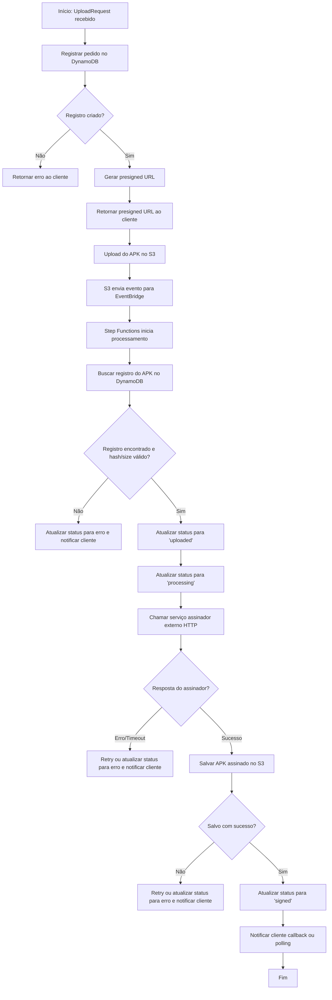

# Fluxo de Assinatura de APKs com Tratamento de Falhas

Este documento detalha o fluxo de trabalho do processo de assinatura de APKs, incluindo os principais pontos de falha e estratégias de tratamento de exceções.

---

## Estratégias de Tratamento de Falhas

- **Validação de integridade:**
  - O Step Functions valida se o registro do APK existe no DynamoDB e se hash/size conferem.
  - Se não existir ou não bater, status de erro e notificação ao cliente.
- **Falhas de comunicação externa:**
  - Retries automáticos configurados no Step Functions para falhas temporárias.
  - Após esgotar tentativas, status de erro e notificação ao cliente.
- **Falhas de escrita/leitura:**
  - Retries automáticos para operações em DynamoDB e S3.
  - Dead-letter queue (DLQ) para casos não recuperáveis.
- **Notificação de erro:**
  - Sempre que possível, o cliente é notificado via callback HTTP (webhook) ou pode consultar o status via polling.
- **Auditoria e logging:**
  - Todas as falhas e exceções são registradas para auditoria e troubleshooting.

---

*Este fluxo detalha os principais pontos de decisão e falha do processo de assinatura, promovendo resiliência, rastreabilidade e comunicação clara com o cliente.*
